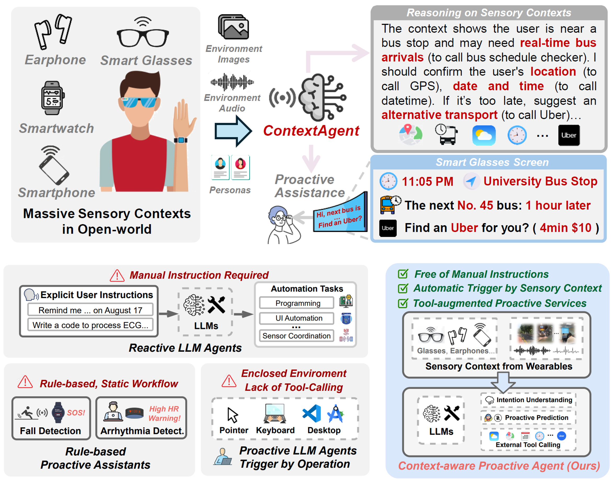

<br>
<p align="center">
<h1 align="center"><strong>ContextAgent: Context-Aware Proactive LLM Agents
with Open-World Sensory Perceptions</strong></h1>
  <p align="center">
    <a href='https://scholar.google.com/citations?user=q_KcYaQAAAAJ&hl=zh-CN' target='_blank'>Bufang Yang<sup>†</sup></a>&emsp;
    <a href='https://initxu.github.io/' target='_blank'>Lilin Xu<sup>†</sup></a>&emsp;
    <a href='https://acomze.github.io/' target='_blank'>Liekang Zeng</a>&emsp;
    <a href='https://www.linkedin.com/in/kaiwei-liu-743567219/?originalSubdomain=hk' target='_blank'>Kaiwei Liu</a>&emsp;
    <a href='http://syjiang.com/' target='_blank'>Siyang Jiang</a>&emsp;
    <a href='https://openreview.net/profile?id=~Wenrui_Lu3' target='_blank'>Wenrui Lu</a>&emsp; <br>
    <a href='https://www.ie.cuhk.edu.hk/faculty/chen-hongkai/' 
    target='_blank'>Hongkai Chen</a>&emsp;
    <a href='http://fredjiang.com/' target='_blank'>Xiaofan Jiang</a>&emsp;
    <a href='https://staff.ie.cuhk.edu.hk/~glxing/' target='_blank'>Guoliang Xing</a>&emsp;
    <a href='https://yanzhenyu.com/' target='_blank'>Zhenyu Yan</a>&emsp;
    <br>
    The Chinese University of Hong Kong&emsp;Columbia University
  </p>
</p>


## 🏠 About
<div style="text-align: center;">
    
</div>
In this paper, we introduce ContextAgent, the first context-aware proactive LLM agent that harnesses extensive sensory contexts for enhanced proactive services.


<!-- ## Overview -->

## 🗺️ Overview
<div style="text-align: center;">
    
</div>

## 📂 Project Structure
```
ContextAgent/
├── src/                          
│   ├── icl/                      
│   │   ├── inference_api.py      
│   │   └── inference.py          
│   ├── sft/                      
│   │   ├── train.py             
│   │   └── eval_sft.sh           
│   ├── tools/                    
│   ├── utils/                   
│   └── config.py                
├── data/                        
│   └── cab/                      
├── prompt/                       
├── scripts/                      
├── LLaMA-Factory/               
├── setup.py                      
├── pyproject.toml               
├── requirements.txt              
├── environment.yml              
```

## ⚙️ Installation

### Method 1: Using pip (Recommended)
```bash
# Clone the repository
git clone https://github.com/bf-yang/ContextAgent.git
cd ContextAgent

# Install the package
pip install -e .

# Install LLaMA-Factory (required for SFT experiments)
pip install -e ./LLaMA-Factory
```

### Method 2: Using conda
```bash
# Clone the repository
git clone https://github.com/bf-yang/ContextAgent.git
cd ContextAgent

# Create conda environment from environment file
conda env create -f environment.yml
conda activate contextagent

# Install the package
pip install -e .
```

## 📊 Evaluation

### 🔑 Configuration

#### Environment Variables Setup
ContextAgent requires several API keys for external tool integrations. Configure them using one of the following supported methods:

**Option 1: Export variables inline (no script)**
```bash
# Azure OpenAI Configuration
export AZURE_OPENAI_API_KEY="your_azure_openai_api_key_here"
export AZURE_OPENAI_ENDPOINT="https://your-resource-name.openai.azure.com/"
export AZURE_OPENAI_API_VERSION="2024-02-15-preview"

# External API Keys for Tools
export GOOGLE_MAP_API_KEY="your_google_maps_api_key_here"
export AMAP_API_KEY="your_amap_api_key_here"
export LOCATIONIQ_API_KEY="your_locationiq_api_key_here"
export SERPAPI_KEY="your_serpapi_key_here"
export GOOGLE_CALENDAR_ACCOUNT="your_google_calendar_account_here"

# Set GPU devices (optional)
export CUDA_VISIBLE_DEVICES=0,1  # Use GPUs 0 and 1
```

**Option 2: Source a shell script (recommended for convenience)**
```bash
# Edit with your own credentials
$EDITOR scripts/env/export_env.sh

# Load variables into your shell
source scripts/env/export_env.sh
```


### ️▶️ Usage
#### ⚙️ 1. ICL Setting
The following provides scripts for evaluating different LLMs under In-Context Learning (ICL) settings.  It supports multiple base models (e.g., GPT-4o, Qwen, LLaMA, and DeepSeek series) and two execution modes: **`live`** and **`sandbox`**.


- **Open-source models.** Test open-source LLMs (e.g., Llama-3.1-8B-Instruct and Qwen2.5-7BInstruct).


  - Python (direct)
    ```bash
    python src/icl/inference.py --model <MODEL_NAME> --mode sandbox
    ```

  - Shell script
    ```bash
    bash scripts/icl/run_infer_local.sh
    ```

- **Proprietary LLMs.** Use API inference for proprietary LLMs (e.g., GPT-4o).

  - Python (direct)
    ```bash
    python src/icl/inference_api.py --model <MODEL_NAME> --mode sandbox
    ```

  - Shell script
    ```bash
    bash scripts/icl/run_infer_api.sh
    ```

| Argument  | Type   | Description                                                                 |
|-----------|--------|-----------------------------------------------------------------------------|
| `--model` | string | Base model to evaluate (e.g., `qwen2.5:latest`, `llama3.1:8b`, `deepseek-r1`) 
| `--mode`  | string | • **`live`** – the agent actually executes external tools and APIs <br>• **`sandbox`** – the agent uses predefined sandboxed results without making real API calls |

- **Metrics**. After inference finishes, compute metrics per model.
Run one command per model you want to score (don’t pass two models at once).
Calculte score:
```
python src/calculate_scores.py --methods icl --model_base_icl <MODEL_NAME>
```
👉 For more details, see [README.md](src/icl/README.md).

#### ⚙️ 2. SFT Setting
Launch supervised fine-tuning (SFT) experiments via:
```
bash scripts/sft/run_sft_exp.sh
```
> [!NOTE]
> 
> **What the script does**
> - Training – calls `LLaMA-Factory/experiments/cab_lora_train.sh` (LoRA/SFT configs).
> - Evaluation – runs `scripts/sft/run_sft_eval.sh` to evaluate fine-tuned models.
>
> **Customize**
> - Edit `LLaMA-Factory/experiments/cab_lora_train.sh` to set the base model and SFT/LoRA parameters.
> - Edit `scripts/sft/run_sft_eval.sh` to choose the base model and evaluation mode.
>
> **Tip**
> - Keep the same base model name across training and evaluation for consistency.

👉 For more details, see [README.md](src/sft/README.md).

 

## 🔗 Citation

If you find our work and this codebase helpful, please consider starring this repo 🌟 and cite:

```bibtex
@article{yang2025contextagent,
  title={ContextAgent: Context-Aware Proactive LLM Agents with Open-World Sensory Perceptions},
  author={Yang, Bufang and Xu, Lilin and Zeng, Liekang and Liu, Kaiwei and Jiang, Siyang and Lu, Wenrui and Chen, Hongkai and Jiang, Xiaofan and Xing, Guoliang and Yan, Zhenyu},
  journal={Advances in Neural Information Processing Systems},
  volume={38},
  pages={1--10},
  year={2025}
}
```
